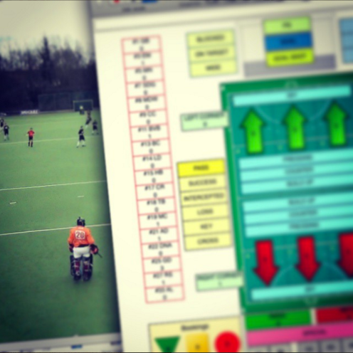
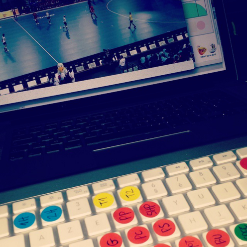
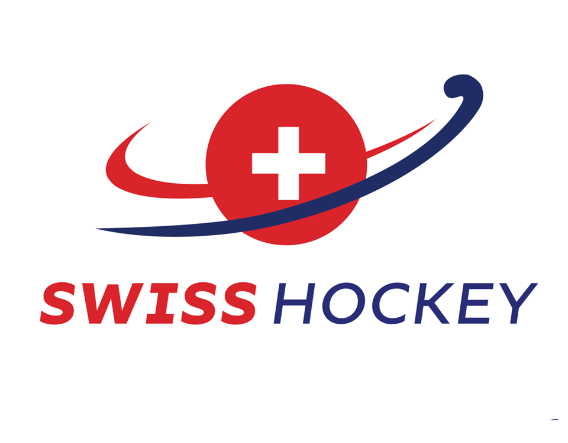
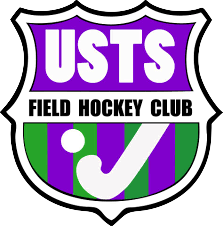
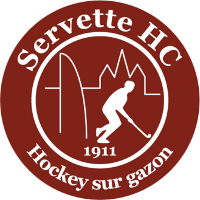
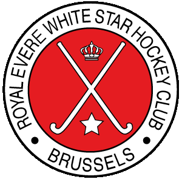
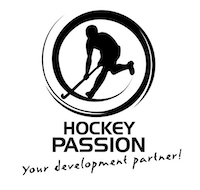

We provide services, in :flag_be: Belgium | :flag_fr: France | :flag_ch: Switzerland | ... | :globe_with_meridians: *Anywhere*, around field & indoor hockey coaching as well as video and performance analysis.

> *"Homines dum docent discunt"* (Humans learn when they teach) - Seneca.

{ style="width:45%;" }
{ style="width:45%;" }

**Clubs and National Associations which we've worked with:**

[{ style="width:20%;" }](https://www.swisshockey.org){:target="_blank"}
[{ style="width:20%;" }](https://www.ustsfieldhockey.ch){:target="_blank"} 
[{ style="width:20%;" }](http://www.servettehc.ch){:target="_blank"}

---

[{ style="width:20%;" }](https://hockey.be){:target="_blank"} 
[{ style="width:20%;" }](https://whitehockey.be){:target="_blank"} 

---

## The TEAM

[**Xavier Santolaria**](./team/xs.md)

:material-office-building: Founder **X14S**

[:fontawesome-brands-instagram:](https://instagram.com/x14santo){:target="_blank"}

---

## Partners

{:target="_blank"}

{:target="_blank"}

{:target="_blank"}

{:target="_blank"}

{:target="_blank"}

{:target="_blank"}

Interested in becoming a **X14S** partner? [Contact Us :fontawesome-solid-paper-plane:](mailto:xavier@santolaria.net)

---

???+ quote ":field_hockey: Recommended Training Gear"
    Training gear that we've been using for our training sessions, whatever the age group or level, that we're recommending you.

    - [**Crazy Catch** Wild Child Rebound Net](https://amzn.to/47gV6Wn){:target="_blank"}: random, unpredictable, rebounds. Perfect for goalies and field players reflex development.
    - [Katchet Training Aid ramp](https://amzn.to/3rO1FPP){:target="_blank"}: perfect to work on deflections, passing & receiving skills, and goalie training.

???+ quote ":books: Recommended Readings"
    A non-exhaustive list of books and articles that helped me to improve as trainer, coach, and human being, enjoy!

    - [SMALL-SIDED GAMES: How to effectively train your players in variable and complex environments](https://amzn.to/3qc7eqU){:target="_blank"}, by Andreu Enrich
    - [The Champion’s Mind: How Great Athletes Think, Train, and Thrive](https://amzn.to/45s8XHJ){:target="_blank"}, by Jim Afremow
    - [Hidden Potential: The Science of Achieving Greater Things](https://amzn.to/3EpPJKE){:target="_blank"}, by Adam Grant
    - [7 Keys To Being A Great Coach: Become Your Best and They Will Too](https://amzn.to/44NxV4l){:target="_blank"}, by Allistair McCaw
    - [The Manager: Inside the Minds of Football’s Leaders](https://amzn.to/4779ksN){:target="_blank"}, by Mike Carson

???+ quote ":tools: Recommended Recovery Options"
    Tools and products that we've been personally using, and thus recommending for your recovery.

    - [**Compex** Fixx Mini Ultra Compact Massage Gun](https://amzn.to/3qc7iHa){:target="_blank"}: perfect for the recovery, and sore muscles!
    - [**TriggerPoint** Foam Roller](https://amzn.to/3YeXFE6){:target="_blank"}: perfect for the recovery, and sore muscles!
