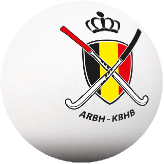

# WHERE SPORT MEETS TECHNOLOGY

## WHAT DO WE DO?

We provide services, in :flag_be: Belgium | :flag_fr: France | :flag_ch: Switzerland | ... | :globe_with_meridians: *Anywhere*, around field & indoor hockey coaching as well as video and performance analysis.

{ style="width:45%;" }
{ style="width:45%;" }

**Clubs and National Associations which we've worked with:**

[{ style="width:20%;" }](https://www.ustsfieldhockey.ch){:target="_blank"} 
[{ style="width:20%;" }](http://www.servettehc.ch){:target="_blank"} 
[{ style="width:20%;" }](https://hockey.be){:target="_blank"} 
[{ style="width:20%;" }](https://whitehockey.be){:target="_blank"} 

---

## TEAM

[:fontawesome-brands-twitter:](https://twitter.com/x14santo){:target="_blank"} 
[:fontawesome-brands-instagram:](https://instagram.com/x14santo){:target="_blank"}
[**Xavier Santolaria**](https://drive.google.com/file/d/0B_2zPJ_8FKViUXppbUlUOXBKMjA/view?usp=sharing){:target="_blank"} 

:material-office-building: Founder **X14S**

---

## PARTNERS

    

        
    

    

        
    

    

        
    

Interested in becoming a **X14S** partner? [Contact Us :fontawesome-solid-paper-plane:](mailto:xavier@santolaria.net)

---

## RECOMMENDED READINGS

A non-exhaustive list of books and articles that helped me to improve as trainer, coach, and human being, enjoy!

- [SMALL-SIDED GAMES: How to effectively train your players in variable and complex environments](https://amzn.to/44h4VCc){:target="_blank"} , by Andreu Enrich
- [The Champion’s Mind: How Great Athletes Think, Train, and Thrive](https://amzn.to/40KSifC){:target="_blank"} , by Jim Afremow
- [7 Keys To Being A Great Coach: Become Your Best and They Will Too](https://amzn.to/3Vipuda){:target="_blank"} , by Allistair McCaw
- [The Manager: Inside the Minds of Football’s Leaders](https://amzn.to/3LEDiM0){:target="_blank"} , by Mike Carson