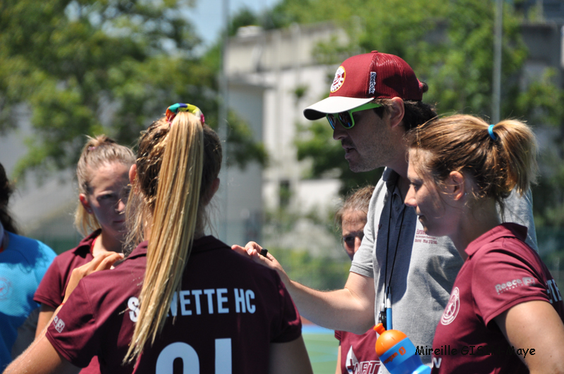

# MEDIA

Blogs, articles, press coverage of Xavier Santolaria's coaching journey.

---

## :calendar: 2025

---

### 2025-06-02: "[WHY YOUTH HOCKEY PLAYERS NEED VIDEO ANALYSIS](https://www.leadfieldhockey.com/blog/why-youth-hockey-players-need-video-analysis){:target="_blank"}"

???+ quote " "
    In today’s fast-evolving sports landscape, video analysis is no longer the preserve of elite athletes—it’s becoming a game-changer at the youth level, especially in a fast-paced and tactical sport like field hockey. While pitch time, drills, and physical training remain critical, the ability to see and understand the game differently is helping players learn faster, play smarter, and work better as a team.

<small>source: [leadfieldhockey.com](https://www.leadfieldhockey.com/){:target="_blank"} :flag_be: :globe_with_meridians:</small>

---

## :calendar: 2024

---

### 2024-06-26: "[HOCKEY SUR GAZON: À L’US TERRE SAINTE, LES JEUNES POUSSES PORTENT LE CLUB](https://www.lacote.ch/vaud/la-cote/terre-sainte/hockey-sur-gazon-a-lus-terre-sainte-les-jeunes-pousses-portent-le-club-1399062){:target="_blank"}"

???+ quote " "
    Xavier Santolaria a de quoi sourire. Cette saison, à Terre Sainte, sa section hockey sur gazon a rencontré un franc succès, avec deux médailles nationales remportées: les M12 féminines ont été sacrées vice-championnes suisses, alors que samedi dernier, c’est l’équipe mixte de la même catégorie d’âge qui a obtenu le bronze.
    
    «Les choses vont dans le bon sens et on commence réellement à préparer l’avenir, explique l’ancien joueur, installé en tant que directeur sportif depuis la saison dernière. Cette année a été axée sur le développement. Nous avons mis en place des entraînements plus professionnels et nous avons intégré de nouveaux entraîneurs. Cela porte ses fruits.»

<small>source: [lacote.ch](https://www.lacote.ch/){:target="_blank"} :flag_ch: :newspaper:</small>

---

## :calendar: 2019

---

### 2019-04-11: "[XAVIER’S SEARCH FOR SMARTER PLAYERS](https://www.coach-logic.com/blog/xaviers-search-for-smarter-players/){:target="_blank"}"

???+ quote " "
    As one of the top teams in Switzerland, Servette HC is a club with high ambitions and an active membership.

    And there is none more active or energetic than coach **Xavier Santolaria**.

    Xavier has huge experience within hockey. He played and captained Belgium club team Royal Evere White Star Hockey and then became the assistant coach to the Belgium Women’s national indoor squad.

???+ quote " "
    Having moved to Switzerland for professional reasons back in November 2015, he took the Servette HC Women's team Head Coach position until the end of the 2016-2017 season. He was then offered the Head Coach position of the Men's team in the summer of 2017. Still occupying this role, he is using his vast and varied experience to good effect with the current squad.

    Coach Logic caught up with the Belgium coach to chat about technology within the sport and his own coaching philosophy.

<small>source: [coach-logic.com](http://www.coach-logic.com/){:target="_blank"} :flag_gb: :globe_with_meridians:</small>

---

## :calendar: 2018

---

### :newspaper: 2018-06-18: "[VICE-CHAMPION, SERVETTE NE VEUT PAS EN RESTER LÀ](https://www.tdg.ch/sports/actu/vicechampion-servette-veut-rester/story/30662106){:target="_blank"}"

???+ quote "Vice-champion, Servette ne veut pas en rester là"
    Si Servette a tardé à tenir son rang, c'est parce que l'équipe a dû apprendre à vivre avec un nouveau coach – **Xavier Santolaria** entraînait jusque-là les filles du club – et sans plusieurs titulaires partis sous d'autres cieux. «*Une période d'adaptation pour faire monter la mayonnaise et favoriser la progression de nos jeunes joueurs*», indique le Belge. L'apport de deux préparateurs physiques et l'expérience retirée d'un tournoi de Coupe d'Europe disputé à Richemont ont permis aux Servettiens de muscler leur jeu et leur confiance. Logiquement, les résultats ont suivi. «*En début, on a peut-être donné l'impression de faire un pas en avant pour deux en arrière. Mais ce printemps, on a fait l'inverse!*»

<small>source: [tdg.ch](http://www.tdg.ch/){:target="_blank"} :flag_ch: :newspaper:</small>

---

### 2018-06-15: "[XAVIER SANTOLARIA PROLONGÉ JUSQU’EN 2020](http://www.servettehc.ch/xavier-santolaria-prolonge-jusquen-2020/){:target="_blank"}"

???+ quote "Xavier Santolaria prolongé jusqu’en 2020"
    Investi depuis novembre 2015 au Servette HC, où il avait tout d’abord dirigé l’équipe féminine, Xavier Santolaria avait ensuite repris les rênes de la Première équipe masculine depuis juillet 2017. Le travail effectué cette première année a convaincu le club de continuer l’aventure avec l’expérimenté coach belge pour deux saisons supplémentaires. « *Je suis heureux de pouvoir poursuivre, avec le soutien du comité du Servette HC, le projet initié depuis plusieurs années, à savoir l’intégration des jeunes et la constitution d’un noyau solide dans l’équipe fanion, pour lui permettre de continuer à rester compétitive au plus haut niveau suisse ces prochaines années.* »

<small>source: [servettehc.ch](http://www.servettehc.ch/){:target="_blank"} :flag_ch: :globe_with_meridians:</small>

---

### :newspaper: 2018-05-22: "[LE HC SERVETTE ASSURE LE MINIMUM À RICHEMONT](https://www.tdg.ch/sports/actu/hc-servette-assure-minimum-richemont/story/15508881){:target="_blank"}"

<small>source: [tdg.ch](http://www.tdg.ch/){:target="_blank"} :flag_ch: :newspaper:</small>

---

## :calendar: 2017

---

### :tv: 2017-09-20: "[LÉMAN BLEU SPORT LE MAG : ENTRETIEN AVEC LE NOUVEL ENTRAINEUR DU SERVETTE HOCKEY SUR GAZON, XAVIER SANTOLARIA](http://www.lemanbleu.ch/Scripts/Modules/CustomView/List.aspx?idn=9992&name=ReplaySearch&VideoID=33013&EmissionID=30168){:target="_blank"}"

<small>source: [lemanbleu.ch](http://www.lemanbleu.ch){:target="_blank"} :flag_ch: :tv:</small>

---

### 2017-07-06: "[XAVIER SANTOLARIA NOUVEL ENTRAÎNEUR PRINCIPAL DES MESSIEURS](http://www.servettehc.ch/xavier-santolaria-nouvel-entraineur-principal-des-messieurs/){:target="_blank"}"

???+ quote "Xavier Santolaria nouvel entraîneur principal des Messieurs"
    **Le Servette HC a le plaisir d’annoncer la signature de Xavier Santolaria (36 ans) en tant que « Head Coach » de la Première équipe masculine.**

    C’est dans un esprit de continuité que s’inscrit le nouvel engagement de Xavier au sein du Servette HC. En effet, le coach belge s’est fait connaître dans le club en dirigeant l’équipe féminine servettienne depuis novembre 2015 et en l’amenant au titre de [**champion suisse de LNB**](http://www.servettehc.ch/les-champ-ionnes/) cette année. Il a également déjà été fortement impliqué avec les Messieurs en officiant en tant qu’adjoint auprès de Pierre-Emmanuel Coppin lors des deux dernières Coupes d’Europe disputées par les Grenat (2016 à Vienne et [**2017 à Gibraltar**](http://www.servettehc.ch/eurohockey-mens-club-champions-challenge-ii-2017/)).

<small>source: [servettehc.ch](http://www.servettehc.ch/){:target="_blank"} :flag_ch: :globe_with_meridians:</small>

---

### 2017-06-04: "[PROMOTION EN CHALLENGE I](http://www.servettehc.ch/promotion-en-challenge-i/){:target="_blank"}"

{ style="width:40%;" }
{ style="width:40%;" }

<small>source: [servettehc.ch](http://www.servettehc.ch/){:target="_blank"} :flag_ch: :globe_with_meridians:</small>

---

## :calendar: 2016

---

### 2016-09-14: "[FHANALYTICS – FIELD HOCKEY ANALYTICS](https://self-pass.com/2016/09/14/fhanalytics-field-hockey-analytics/){:target="_blank"}"

<small>source: [self-pass.com](http://www.self-pass.com/){:target="_blank"} :flag_pt: :globe_with_meridians:</small>

---

### 2016-01-27: "[FOCUS SUR LES ÉQUIPES FÉMININES DANS LE CANTON DE GENÈVE](http://www.lemanbleu.ch/replay/video.html?VideoID=28709){:target="_blank"}"

<small>source: [lemanbleu.ch](http://www.lemanbleu.ch){:target="_blank"} :flag_ch: :tv:</small>

---

## :calendar: 2015

---

### 2015-11-30: "[AMBITIONS ET DÉVELOPPEMENT AU SERVETTE HC](http://www.aghga.ch/les-black-girls-remportent-facilement-le-derby-en-salle/){:target="_blank"}"

???+ quote "Ambitions et développement"
    **Xavier Santolaria** est arrivé il y a deux mois à Genève et a accepté de reprendre le Servette HC pour la saison en salle. Son objectif est de faire grandir l’équipe en vue de la reprise du championnat à l’extérieur : « *Mon travail est de faire progresser mes joueuses et d’utiliser l’expérience accumulée en salle pour être encore meilleurs au retour sur le gazon. Nos ambitions restent modestes puisque nous visons le maintien. Pour y parvenir, nous effectuons un gros travail, car le hockey en salle se différencie beaucoup de celui pratiqué sur gazon* ».

    En ce qui concerne le développement du hockey féminin genevois, l’entraineur belge se montre enthousiaste: « *Il existe d’excellentes infrastructures pour aider à faire progresser les filles. Je trouve que le niveau du championnat est élevé et tout ceci est évidemment positif. Tout est mis en œuvre pour que le hockey genevois avance et que nous puissions alimenter l’équipe nationale* ».

<small>source: [aghga.ch](http://www.aghga.ch){:target="_blank"} :flag_ch: :globe_with_meridians:</small>

---

### 2015-01-19: "[XAVIER SANTOLARIA TREKT MET RED FOXES NAAR WK ZAALHOCKEY](https://www.bruzz.be/sport/xavier-santolaria-trekt-met-red-foxes-naar-wk-zaalhockey-2015-01-14){:target="_blank"}"

_Pascal%20Motte_cmyk.jpg){ style="width:40%;" }

???+ quote "Wat doet een assistent?"
    In een discipline als zaalhockey, waar met weinig middelen wordt gewerkt, is de rol van de assistent groot. "*Ik praat veel met de coach over zaken als tactiek en techniek, over de aanpak van spelfases, wat we kunnen verbeteren, enzovoort. Een ander onderdeel van mijn werk is het maken van videoanalyses. Dat betekent heel wat matchen bekijken en bepaalde sequenties in filmpjes monteren. Tijdens matchen op een EK of een WK zit ik in de tribune en heb ik contact met de hoofdcoach. Ik krijg de beelden rechtstreeks op mijn computer en monteer een film die tijdens de rust getoond kan worden. Ik werk in de schaduw, maar dat niet dat je me nooit meer als hoofdcoach aan het werk zal zien.*"

<small>source: [bruzz.be](https://www.bruzz.be){:target="_blank"} :flag_be: :globe_with_meridians:</small>

---

## :calendar: 2013

---

### 2013-01-07: "[LES RED FOXES EN CAMPAGNE](http://okey.lalibre.be/fr/salle-les-red-foxes-en-campagne.html?cmp_id=7&news_id=1093){:target="_blank"}"

Interview avec [Philippe Demaret](https://twitter.com/phdemaret) de [Okey.be](http://okey.lalibre.be/) à propos de cette année sans compétition officielle pour les équipes nationales salle. L’article complet est aussi disponible [ici](http://okey.lalibre.be/fr/salle-les-red-foxes-en-campagne.html?cmp_id=7&news_id=1093&vID=3).

???+ quote "Interview (FR)"

    **Okey** : Quel est le programme de cette année ?

    **Xavier Santolaria** : Etant donné qu’il n’y a pas de compétition officielle, cette année est essentiellement consacrée à continuer le travail entamé l’année dernière. Tant sur le plan tactique que technique.

    Une dizaine de sessions sont au calendrier, incluant des matchs amicaux face à Cambrai, Lille et Kampong (HOL). Durant le week-end du nouvel An, nous avons également effectué un mini-stage de deux jours à Evere en terminant par un match contre Cambrai, victoire 6-4 des Red Foxes (score à la mi-temps en faveur de Cambrai 2-4).

    **Okey** : Il n’y a pas de tournoi internationaux cette année, pas facile de se donner un objectif ?

    **Xavier Santolaria** : Effectivement, le championnat d’Europe ne se disputant qu’en 2014, il n’y a pas d’objectif immédiat pour 2013. Ceci n’enlève en rien à l’importance de cette préparation dont le but et de faire encore progresser le groupe sur les plans technique et tactique, ainsi qu’au niveau de sa cohésion.

    Cela nous donne aussi l’opportunité de travailler plus en profondeur. N’oublions pas qu’évoluant en Championship II, des places qualificatives pour la Coupe du Monde 2015 sont aussi en jeu. Nous profitons donc de cette année sans compétions officielles pour mettre en place des bases solides pour le futur.

    **Okey** : Le noyau est restreint ; pas facile de recruter ?

    **Xavier Santolaria** : Le noyau est effectivement similaire, en nombre, à la saison dernière — la base restant la même. Sur les 12 joueuses de Porto, 8 continuent l’aventure et Elizabeth Achten rejoint le staff comme entraîneur des gardiens.
    Afin de composer un groupe avec des filles jouant au plus haut niveau national, le staff visionne les matches du championnat DH principalement, mais aussi la D1. C’est d’ailleurs comme ça que nous avons appelé plusieurs joueuses à nous rejoindre, après les 2 premières journées de championnat.

    Cette année nous permet aussi d’intégrer de nouvelles joueuses et de bénéficier d’un noyau plus large en vue de 2014, pour les A, mais aussi de 2015 pour l’équipe Juniors. Il est fort possible que d’autres filles nous rejoignent lors de la prochaine préparation en 2013-2014.
   
    Malgré le noyau restreint, on voit quand même que de plus en plus de clubs prennent le championnat salle au sérieux et que de plus en plus de filles ont envie de franchir un cap. La sélection des 12 pour Šiauliai risque d’être compliquée l’année prochaine.

    **Okey** : Les salles , un souci ?

    **Xavier Santolaria** : Les salles sont toujours difficiles à avoir en Belgique, que ce soit pour le championnat ou pour les équipes nationales. Mais grâce à un travail de titan de René Dautel et du BIH, nous bénéficions cette saison encore, une fois par semaine, du beau parquet de la salle de l’université de Gand. En plus de ça, le BIH a conclu un accord avec l’Ecole Royale Militaire (ERM), une fois par semaine également, pour les équipes nationales. Salle dont le superbe parquet permet de travailler dans de bonnes conditions.

<small>source: [okey.lalibre.be](http://okey.lalibre.be){:target="_blank"} :flag_be: :globe_with_meridians:</small>
