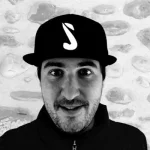
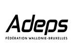
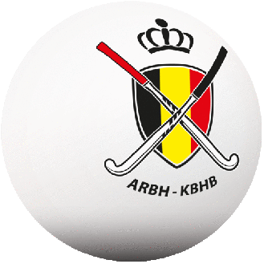

# Xavier Santolaria

## Objectives

Grow as a coach, gain and pass on all of the knowledge, skills, and
experiences that I obtained through the years of playing and coaching.

## Education 

| Organization | Course/Diploma | Year |
| :----------: | -------------- | :--: |
|  | ***Moniteur Sportif Educateur*** (Diploma) **ADEPS**, Belgium | 2014 |
| { style="width:20%;" } | ***Moniteur Sportif Initiateur*** (Diploma) **ADEPS**, Belgium | 2013 |
| { style="width:20%;" } | ***Level 3 Coach*** (Diploma) **ARBH/KBHB**, Belgium | 2012 |
| { style="width:20%;" } | ***Indoor Hockey Clinic (by G. Van Eijk (NL))*** **ARBH/KBHB**, Belgium | 2010 |

## Experience

### Player

- 2001-2008: **Royal E. White Star H.C.** Men's 1st Team (indoor)
- 2002-2007: **Royal E. White Star H.C.** Men's 1st Team

### Coaching

#### USTS :flag_ch:

##### Sep. 2022 to Current

- **Head Coach**, U15 Junior Team:
    - In charge of game, and training plans
    - In charge of training sessions
    - Youth development

##### Sep. 2021 to Jun. 2022

- **Head Coach**, U12 Junior Team:
    - In charge of game, and training plans
    - In charge of training sessions
    - Youth development

#### Servette HC :flag_ch:

##### Jul. 2017 to Jun. 2020

- **Head Coach**, Men's 1st Team:
    - In charge of game, and training plans
    - In charge of training sessions
    - In charge of video analysis

- Tournaments:
    - 2019 EuroHockey Club Challenge I (5th) :flag_pl:
    - 2018 EuroHockey Club Challenge I (5th) :flag_ch:

##### Nov. 2015 to Jun. 2017

- **Head Coach**, Women’s 1st Team:
    - In charge of game, and training plans
    - In charge of training sessions

##### Feb. 2016 to Jun. 2017

- **Assistant Coach**, Men's 1st Team:
    - Assisted with training sessions and video/performance analysis

- Tournaments:
    - 2017 EuroHockey Club Challenge II (1st – Promoted) :flag_gi:
    - 2016 EuroHockey Club Challenge I (7th – Relegated) :flag_at:

#### Belgian Hockey Federation :flag_be:

##### Oct. 2015 to May 2016

- **Head Coach**, BeGold District Girls 2002 (Red):
    - Identify and develop the talents of young hockey players to BeGold National standards

> The BeGold District hockey program is the starting point for hockey players in Belgium who aspire to play for the Red Lions and Red Panthers at worl level tournaments such as the Olympic Games.

#### Royal E. White Star H.C. :flag_be:

##### Dec. 2013 to May 2015

- **Video & Performance Analyst**, Men’s 1st Team (outdoor):
    - In charge of post-match coding to produce statistical information using SportCode Pro, iCoda, and self-developed FHAnalytics online platform
    - In charge of maintenance of videos and other databases

#### Belgian Hockey Federation :flag_be:

##### Sep. 2011 to Feb. 2015

- **Assistant Coach**, Women Belgium Indoor National Team (WBINT) :fox:
    - Assisted with game, and training plans
    - Assisted with training sessions and day to day team operations
    - In charge of video and performance analysis
    - Game duties: live coding, and penalty corners analysis
    - Players scouting

- Tournaments:
    - 2015: FIH Indoor World Cup (11th) :flag_de:
    - 2014: EuroHockey Indoor Nations Championship II (2nd – Promoted) :flag_lt:
    - 2012: EuroHockey Indoor Nations Championship III (1st – Promoted) :flag_pt:

#### Royal E. White Star H.C. :flag_be:

##### Dec. 2012 to Feb. 2014

- **Head Coach**, Men's 1st Team (indoor):
    - In charge of game, and training plans
    - In charge of training sessions

##### Aug. 2011 to May 2012

- **Head Coach**, Men's 2nd Team (outdoor):
    - In charge of game, and training plans
    - In charge of training sessions

##### Dec. 2010 to Feb. 2011

- **Assistant Coach**, Men’s 1st Team (indoor):
    - Assisted with game, and training plans
    - Assisted with training sessions
    - Game duties: penalty corners analysis, tactical chat with subbed-out players

#### Royal Uccle Sport T.H.C. :flag_be:

##### Dec. 2010 to Feb. 2011

- **Assistant Coach**, Men’s 1st Team (indoor):
    - Assisted with game, and training plans
    - Assisted with training sessions
    - Game duties: penalty corners analysis, tactical chat with subbed-out players

#### Royal E. White Star H.C. :flag_be:

##### Aug. 2004 to May 2005

- **Head Coach**, U16 Boys:
    - In charge of game, and training plans
    - In charge of training sessions
    - Youth development

## Honours

#### Player

##### R. E. White Star H.C. :flag_be:

- Belgium Division 1 (f.k.a. Division 2)
    - 2005
- Belgium Indoor
    - 2005, 2006
- EuroHockey Indoor Club Champion Cup
    - Challenge I - Men
        - 2006: 1st :flag_se:

#### Coach

##### Servette H.C. :flag_ch:

- National League A – Men
    - 2018: Vice-Champion
- National League B – Women
    - 2017: Champion

- EuroHockey Club Championships
    - Championship II - Men
        - 2017: 1st :flag_gi:

##### Women Belgium Indoor National Team (WBINT) :fox:

- EuroHockey Indoor Nations Championships
    - Championship II - Women
        - 2014: 2nd :flag_lt:
    - Championship III - Women
        - 2012: 1st :flag_pt:

## Languages

- **French**: Mother tongue
- **English**: C1 (CEF)
- **Spanish**: C1 (CEF)
- **Dutch**: A2 (CEF)