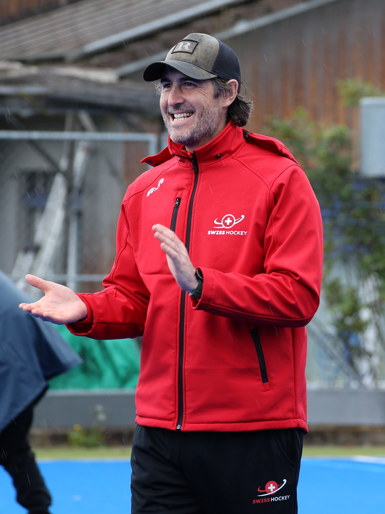
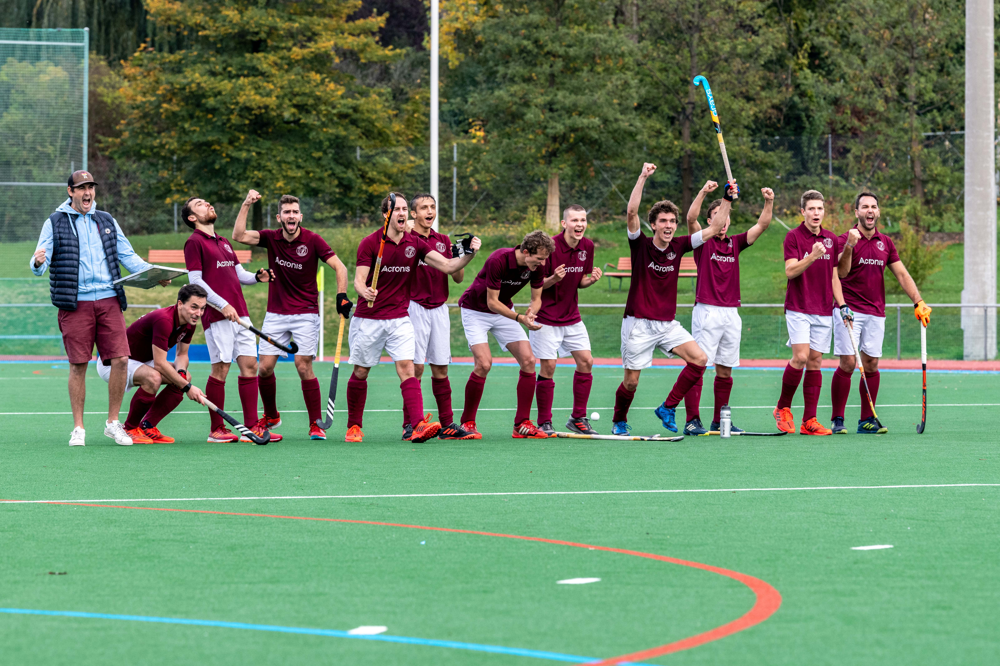

# Xavier Santolaria

## Objectives

{ style="width:25%; align:right;" }

**Driven by Passion, Focused on Growth**

With over **40 years** in the game, my mission as a **field hockey coach** is to keep **growing**,
**mastering** the sport I love, and sharing that **passion** with every **player**, **coach**, and
**club** I work with. I’m committed to **mentoring** the next generation, building **strong teams**,
and creating **unforgettable moments**—whether it’s **lifting a trophy** or simply helping a group
**play their best hockey**. For me, it’s about **joy**, **progress**, and leaving a **lasting impact** on and off the field.

## Education 

### :red_circle: :white_circle: :blue_circle: International Hockey Federation (FIH)

!!! example ""
    :fontawesome-solid-user: **FIH Academy** Profile: [https://academy.fih.hockey/profile?id=67ee5df846798d06a0019968](https://academy.fih.hockey/profile?id=67ee5df846798d06a0019968)

#### Awards :fontawesome-solid-award:

- 2025: **FIH Level 2 Coach** (equivalence)
- 2025: **FIH Level 1 Coach**

#### Workshops :material-presentation:

- 2025: [FIH L3C Online (902)](https://academy.fih.hockey/course?courseid=l3c902) \*\*\*
- 2025: [Talent Identification Workshop (898)](https://academy.fih.hockey/course?courseid=tiw625) \*\*\*\*
- 2025: [Session Design Workshop (890)](https://academy.fih.hockey/course?courseid=sdw890) \*\*\*
- 2025: [Game Analysis Workshop (893)](https://academy.fih.hockey/course?courseid=gaw893) \*\*\*
- 2025: [Integrating Goalkeepers Workshop (892)](https://academy.fih.hockey/course?courseid=igw892) \*\*\*
- 2025: [FIH L1C Online (872)](https://academy.fih.hockey/course?courseid=l1c872)
- 2025: [FIH Top Coach Masterclass (S2.E2): Becoming a Resilient Coach](https://academy.fih.hockey/course/tcms2e2)
- 2025: [FIH Top Coach Masterclass (S2.E1): Breaking Barriers and Lead with Impact](https://academy.fih.hockey/course?courseid=tcms2e1)
- 2024: [FIH Top Coach Masterclass (S1.E6): Blending Culture with Performance](https://academy.fih.hockey/course?courseid=tcms1e6)
- 2024: [FIH Top Coach Masterclass (S1.E5): The Modern Press](https://academy.fih.hockey/course?courseid=tcms1e5)
- 2024: [FIH Top Coach Masterclass (S1.E4): Physical Conditioning](https://academy.fih.hockey/course?courseid=ecms)
- 2024: [FIH Top Coach Masterclass (S1.E3): Midfield in Attack](https://academy.fih.hockey/course?courseid=tcms1e3)
- 2024: [FIH Top Coach Masterclass (S1.E2): Coaching Online](https://academy.fih.hockey/course?courseid=fihtcms1e2)
- 2024: [FIH Top Coach Masterclass (S1.E1): Investigating Individual Creativity](https://academy.fih.hockey/course/tcms1e2)

<small>
\*\*\*\* *Mandatory workshops for the FIH Level 4 Coach Certificate.* 
\*\*\* *Mandatory workshops for the FIH Level 3 Coach Certificate.*
</small>

### :flag_be: Hockey Belgium (ARBH/KBHB)

- 2012: **Level 3 Coach** (*Men's National 1 Division & Women's Honour Division*) :fontawesome-solid-award:
- 2011: *Impressions Of The 2011 World Cup “indoor” in Poznan (POL) And Impact On The Game*, by *Koen Van Praet* :flag_be: :material-presentation:
- 2010: Indoor Hockey Clinic, by *G. Van Eijk* :flag_nl: :material-presentation:

### :flag_be: ADEPS

- 2014: **Moniteur Sportif Educateur** :fontawesome-solid-award:
- 2013: **Moniteur Sportif Initiateur** :fontawesome-solid-award:

## Experience

### Player

- 2023-current: **USTS Field Hockey** :flag_ch:
- 2001-2008: **Royal E. White Star H.C.** Men's 1st Team (indoor) :flag_be:
- 2002-2007: **Royal E. White Star H.C.** Men's 1st Team :flag_be:

### Coach

!!! example ""
    :fontawesome-solid-user: **FIH** Profile: [https://tms.fih.ch/people/3627](https://tms.fih.ch/people/3627)
    
    :fontawesome-solid-user: **EHF** Profile: [https://eurohockey.altiusrt.com/people/6237](https://eurohockey.altiusrt.com/people/6237)

???+ example "Swiss Hockey Federation :flag_ch: (Sep. 2023 to Current)"
    ##### Aug. 2024 to Current

    - **Trainer**, U14 Girls (West):
        - In charge of training sessions

    <figure markdown>
      { loading=lazy }
      <figcaption>SwissHockey U14 Girls West, 2024/2025; Photo &copy; Petra Wagner</figcaption>
    </figure>

    ##### Sep. 2023 to May 2024

    - **Co-Trainer**, U14 Boys (West):
        - Assisting Head Trainer during training sessions  

???+ example "USTS :flag_ch: (Sep. 2021 to Current)"

    ##### Aug. 2024 to Current

    - **Head Coach**, U18 Junior Team:
        - In charge of game, and training plans
        - In charge of training sessions
        - Youth development

    ##### Sep. 2022 to Jun. 2024

    - **Head Coach**, U15 Junior Team:
        - In charge of game, and training plans
        - In charge of training sessions
        - Youth development

    ##### Sep. 2021 to Jun. 2022

    - **Head Coach**, U12 Junior Team:
        - In charge of game, and training plans
        - In charge of training sessions
        - Youth development

??? example "Servette HC :flag_ch: (Nov. 2015 to Jun. 2020)"

    ##### Jul. 2017 to Jun. 2020

    <figure markdown>
      { loading=lazy }
      <figcaption>Servette HC Men's 1 - Season 2019/2020</figcaption>
    </figure>

    - **Head Coach**, Men's 1st Team:
        - In charge of game, and training plans
        - In charge of training sessions
        - In charge of video analysis

    - Tournaments:
        - 2019 EuroHockey Club Challenge I (5th) :flag_pl:
        - 2018 EuroHockey Club Challenge I (5th) :flag_ch:

    ##### Nov. 2015 to Jun. 2017

    - **Head Coach**, Women’s 1st Team:
        - In charge of game, and training plans
        - In charge of training sessions

    ##### Feb. 2016 to Jun. 2017

    - **Assistant Coach**, Men's 1st Team:
        - Assisted with training sessions and video/performance analysis

    - Tournaments:
        - 2017 EuroHockey Club Challenge II (1st – Promoted) :flag_gi: 🥇
        - 2016 EuroHockey Club Challenge I (7th – Relegated) :flag_at:

??? example "Belgian Hockey Federation :flag_be: (Oct. 2015 to May 2016)"

    ##### Oct. 2015 to May 2016

    - **Head Coach**, BeGold District Girls 2002 (Red):
        - Identify and develop the talents of young hockey players to BeGold National standards

    > The BeGold District hockey program is the starting point for hockey players in Belgium who aspire to play for the Red Lions and Red Panthers at worl level tournaments such as the Olympic Games.

??? example "Royal E. White Star H.C. :flag_be: (Dec. 2013 to May 2015)"

    ##### Dec. 2013 to May 2015

    - **Video & Performance Analyst**, Men’s 1st Team (outdoor):
        - In charge of post-match coding to produce statistical information using SportCode Pro, iCoda, and self-developed FHAnalytics online platform
        - In charge of maintenance of videos and other databases

??? example "Belgian Hockey Federation :flag_be: (Sep. 2011 to Feb. 2015)"

    ##### Sep. 2011 to Feb. 2015

    - **Assistant Coach**, Women Belgium Indoor National Team (WBINT) :fox:
        - Assisted with game, and training plans
        - Assisted with training sessions and day to day team operations
        - In charge of video and performance analysis
        - Game duties: live coding, and penalty corners analysis
        - Players scouting

    - Tournaments:
        - 2015: [FIH Indoor World Cup (11th)](https://tms.fih.ch/teamstaff/3934) :flag_de:
        - 2014: [EuroHockey Indoor Nations Championship II (2nd – Promoted)](https://tms.fih.ch/teamstaff/1144) :flag_lt: 🥈
        - 2012: EuroHockey Indoor Nations Championship III (1st – Promoted) :flag_pt: 🥇

    <figure markdown>
      { loading=lazy }
      <figcaption>Women Belgium Indoor National Team - Gold Medal, 2012.</figcaption>
    </figure>

??? example "Royal E. White Star H.C. :flag_be: (Dec. 2010 to Feb. 2014)"

    ##### Dec. 2012 to Feb. 2014

    - **Head Coach**, Men's 1st Team (indoor):
        - In charge of game, and training plans
        - In charge of training sessions

    ##### Aug. 2011 to May 2012

    - **Head Coach**, Men's 2nd Team (outdoor):
        - In charge of game, and training plans
        - In charge of training sessions

    ##### Dec. 2010 to Feb. 2011

    - **Assistant Coach**, Men’s 1st Team (indoor):
        - Assisted with game, and training plans
        - Assisted with training sessions
        - Game duties: penalty corners analysis, tactical chat with subbed-out players

??? example "Royal Uccle Sport T.H.C. :flag_be: (Dec. 2010 to Feb. 2011)"

    ##### Dec. 2010 to Feb. 2011

    - **Assistant Coach**, Women's 1st Team (indoor):
        - Assisted with game, and training plans
        - Assisted with training sessions
        - Game duties: penalty corners analysis, tactical chat with subbed-out players

??? example "Royal E. White Star H.C. :flag_be: (Aug. 2004 to May 2005)"

    ##### Aug. 2004 to May 2005

    - **Head Coach**, U16 Boys:
        - In charge of game, and training plans
        - In charge of training sessions
        - Youth development

## Honours

### Player

#### Royal E. White Star H.C. :flag_be:

- Belgium National 1 Division
    - 2005 🥇
- Belgium Indoor Honour Division
    - 2005, 2006 🥇
- EuroHockey Indoor Club Champion Cup
    - Challenge I - Men
        - 2006: :flag_se: 1st 🥇

### Coach

#### Servette H.C. :flag_ch:

<figure markdown>
  { loading=lazy }
  <figcaption>Servette HC Men's 1 - Vice-Champion 2017/2018</figcaption>
</figure>

- National League A – Men
    - 2018: Vice-Champion 🥈
 
- National League B – Women
    - 2017: Champion 🥇

- EuroHockey Club Championships
    - Championship II - Men
        - 2017: :flag_gi: 1st 🥇

#### Women Belgium Indoor National Team (WBINT) :flag_be:

- EuroHockey Indoor Nations Championships
    - Championship II - Women
        - 2014: :flag_lt: 2nd 🥈
    - Championship III - Women
        - 2012: :flag_pt: 1st 🥇

## Languages

- **French**: Mother tongue
- **English**: C1 (CEF)
- **Spanish**: C1 (CEF)
- **Dutch**: A2 (CEF)
